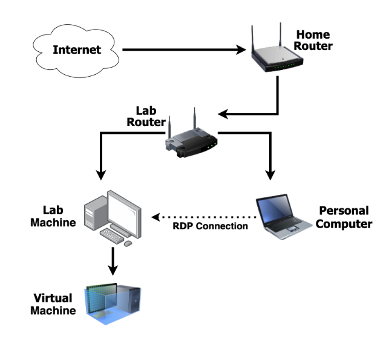

# Class 07

## Class Outline

1. Ops 102 Overview
1. Review
1. Lecture
1. Demo
1. Lab 

## Overview

To use the Ubuntu PC as a true dedicated virtualization server, we'll need to next establish reliable network connectivity to it from our personal computer. To do this, we'll need to apply networking concepts such as IP addressing, ports, and MAC addressing. After configuring and testing remote connectivity to your Ubuntu virtualization server, you'll no longer need to keep it around your desktop workspace and can relocate to a closet or garage with network access. Think of it as your "private cloud," but without the costs!

> The operations depicted in this lab are quite common in the world of networking and systems administration. Most servers are reserved or static IPs, and in this cloud-driven market we're seeing heavy usage of remote desktop solutions such as Microsoft RDP (Remote Desktop Protocol).

<!-- ## How does this topic fit?

**Where we've been**:
In the previous class ...

**What are we focusing on today**:
Today, we'll be doing ...

**Where we're headed**:
Next class will focus on .. -->

## Remote Connectivity 

<!-- ### Why
- This topic is important because ...
- What problems are we facing that this concept will solve... -->

### What
- What are “ports” and why are they numbered?
- What are protocols?
- What does a DHCP server do?
- What is the diffence between static IP, dynamic IP and reserved IP addresses?
- How do I exit my SSH connection in the terminal?

<!-- ### How
- What does the code we need to write have to do to solve these problems?
- What are some of the major concepts we have to tackle
- Briefly describe the type of work students will be seeing in demo and performing in lab -->

<!-- ### Experimentation and Discovery Ideas
  - Provide some ideas here for how the instructor can be interactive with the students
  - Can this be built using the Socratic method?
  - Can we use breakout or small group sessions -->

## Learning Objectives

### Students will be able to

#### Describe and Define

- Network Protocol
- IP
- TCP 
- UDP
- DHCP
- XRDP
- SSH
- SCP
- RDP

#### Execute

- Perform a DHCP reservation on a DHCP server.
- Use XRDP or VNC to remotely access a Ubuntu Linux computer.
- Install an OpenSSH Server in Ubuntu Linux and remotely SSH in.
- Transfer a file to a remote computer using WinSCP.

## Helpful Resources

- [DHCP Reservation](https://homenetworkadmin.com/dhcp-reservation/){:target="_blank"} 
- [Ubuntu RDP access from Windows 10](https://linuxconfig.org/ubuntu-20-04-remote-desktop-access-from-windows-10){:target="_blank"} 
- [Ubuntu VNC access from MacOS](https://www.digitalocean.com/community/tutorials/how-to-install-and-configure-vnc-on-ubuntu-20-04){:target="_blank"} 

## Notes

### How to check OpenSSH status in Linux
- `sudo systemctl status ssh.service`
  - Get the current status of the SSH server.
- `sudo systemctl start ssh.service`
  - Start the SSH server.
- `sudo systemctl stop ssh.service`
  - Stop the SSH server.
- `sudo systemctl restart ssh.service`
  - Restart the SSH server.

# Lab Topology

